<div align="center">

<br/>


<br/><br/>

# Atmosis

**Real-World Air Intelligence — built on the Arduino UNO Q**

<sub>Seven air patterns · Edge Impulse · Gemini 3.5 Flash · Telegram · Live Dashboard</sub>

<br/><br/>

[](https://youtube.com/@NextBuilderIO)
[](https://instagram.com/next_builder)
[](https://x.com/NEXTBUILDERIO)
[](https://www.linkedin.com/company/nextbuilderIO/)
[](https://www.instructables.com/member/Next%20Builder%20DIY/)
[](https://hackster.io/NEXTBUILDER)
[](https://hackaday.io/NextBuilder)

<br/>

</div>

---

<br/>

## Overview

The air around us rarely announces itself. Exhaust from a busy road, dust from a construction site, smoke from burning biomass, fumes from a kitchen, or a closed room slowly running out of fresh air — most of it is invisible and odourless, and almost none of it is measured. A smoke alarm covers the worst day. Nothing covers every other day.

**Atmosis** watches the air every second. It reads nine live values from three sensors, turns them into a single **air score from 1 to 100**, and shows it as colour on an ambient light strip. An **Edge Impulse** model trained on seven real-world air patterns — from clean air and poor ventilation to traffic pollution, construction dust and biomass smoke — recognises *what kind* of situation is forming, not just how high the numbers are. When the air needs attention, **Gemini 3.5 Flash** turns the readings into one clear recommendation, delivered to a live dashboard and to your phone through **Telegram**.

Everything that keeps you safe runs on the microcontroller itself. The light strip and the dust and carbon-monoxide alarms keep working even when the app is stopped or the network is down.

<br/>

---

<br/>

## Highlights

<table>
<tr>
<td width="33%" valign="top">
<b>Real-time sensing</b><br/>
<sub>IAQ, VOCs, formaldehyde, CO, PM2.5, temperature, humidity, pressure and altitude — every second.</sub>
</td>
<td width="33%" valign="top">
<b>On-board safety</b><br/>
<sub>Air score, light strip and dust / CO alarms run on the STM32U585, independent of Linux and the internet.</sub>
</td>
<td width="33%" valign="top">
<b>Edge Impulse</b><br/>
<sub>Recognises seven real-world air patterns — indoors, on the road and around construction or smoke.</sub>
</td>
</tr>
<tr>
<td width="33%" valign="top">
<b>Gemini 3.5 Flash advisor</b><br/>
<sub>Short, specific advice — only when the air needs attention, never repeating itself.</sub>
</td>
<td width="33%" valign="top">
<b>Telegram alerts</b><br/>
<sub>Structured alert cards with rate limiting, plus an evening air report.</sub>
</td>
<td width="33%" valign="top">
<b>Live dashboard</b><br/>
<sub>Glass-style web dashboard with live tiles and trends, in light and dark themes.</sub>
</td>
</tr>
</table>

<br/>

---

<br/>

## Live Dashboard

<div align="center">
<table>
<tr>
<td align="center">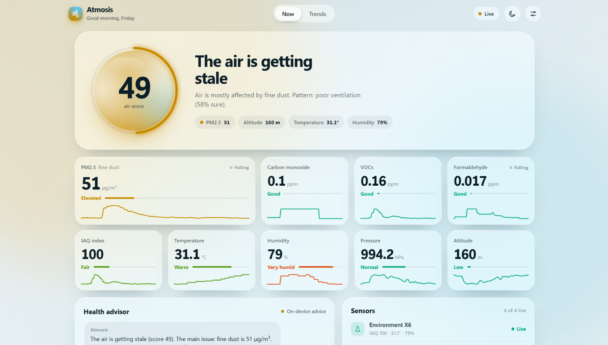</td>
<td align="center">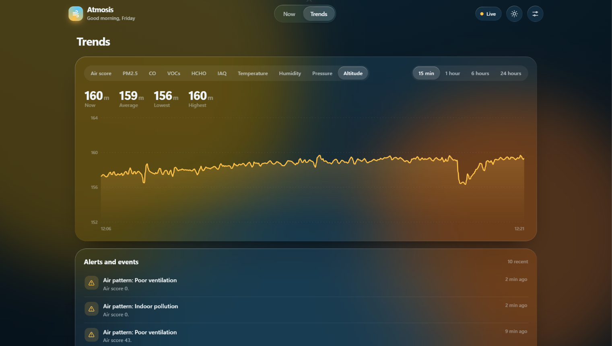</td>
</tr>
</table>
<sub>Atmosis dashboard — air score · nine live sensor tiles · Gemini health advisor · trends · light and dark themes</sub>
</div>

<br/>

---

<br/>

## Telegram Alerts

<div align="center">
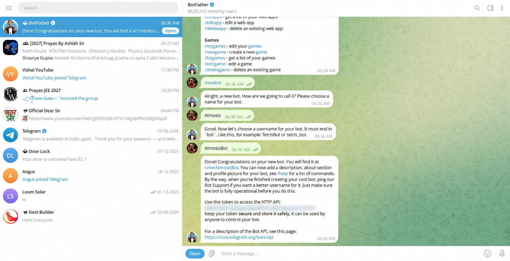
<br/><br/>
<sub>Alert cards with a score bar, full readings, one clear action and a Gemini tip</sub>
</div>

<br/>

| Trigger | Alert |
|---|---|
| Air score falls to 35 / recovers above 55 | Air quality needs attention / has recovered |
| PM2.5 above 150 µg/m³ | Very high dust level |
| CO above 9 ppm | Carbon monoxide alert — sent instantly |
| Edge Impulse detects indoor pollution or poor ventilation | Air pattern alert |
| Board silent for 2 minutes | Sensors not responding |
| Every evening at 9 PM | Daily report — averages, peaks and the worst time of day |

<br/>

---

<br/>

## System Architecture

<div align="center">
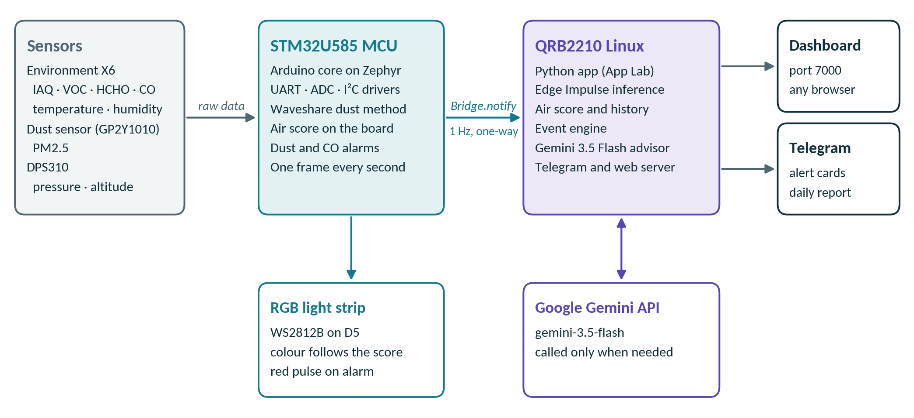
</div>

<br/>

The **Arduino UNO Q** combines two processors on one board, and Atmosis gives each the job it does best.

- **STM32U585 (Arm Cortex-M33, Zephyr)** — reads the sensors with non-blocking drivers, computes the air score, drives the light strip and raises the dust and CO alarms.
- **Qualcomm QRB2210 (Debian Linux)** — runs the Python app: Edge Impulse inference, the Gemini advisor, Telegram alerts and the dashboard on port `7000`.

The microcontroller pushes one frame per second to Linux with `Bridge.notify`. The link is deliberately one-way, so the board never depends on the Linux side to stay safe.

<br/>

---

<br/>

## Edge Impulse

<div align="center">
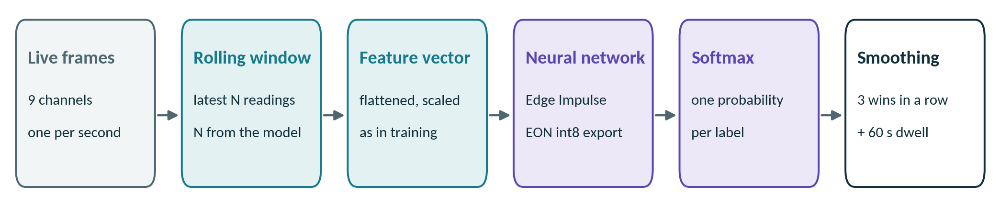
<br/><br/>
<table>
<tr>
<td align="center">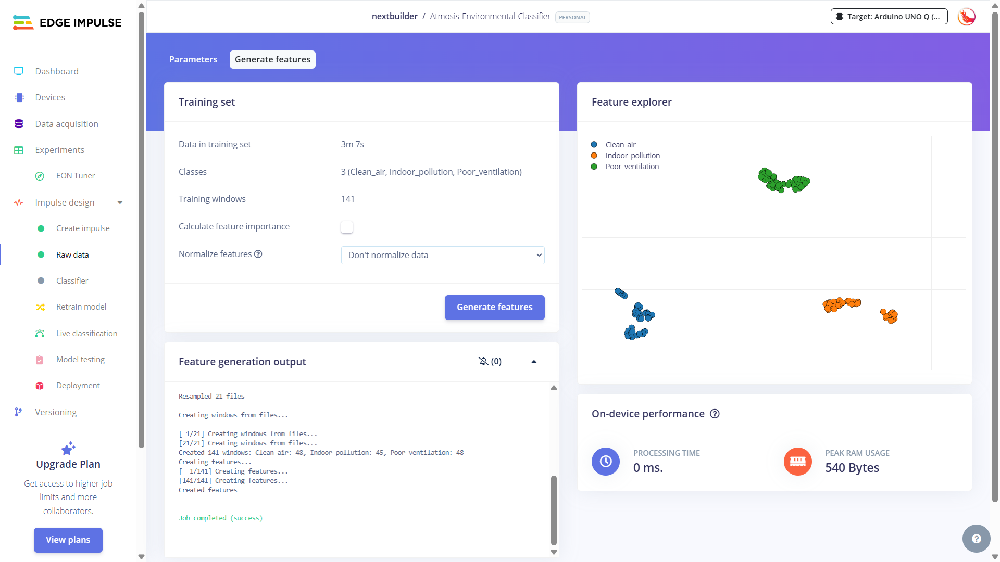</td>
<td align="center">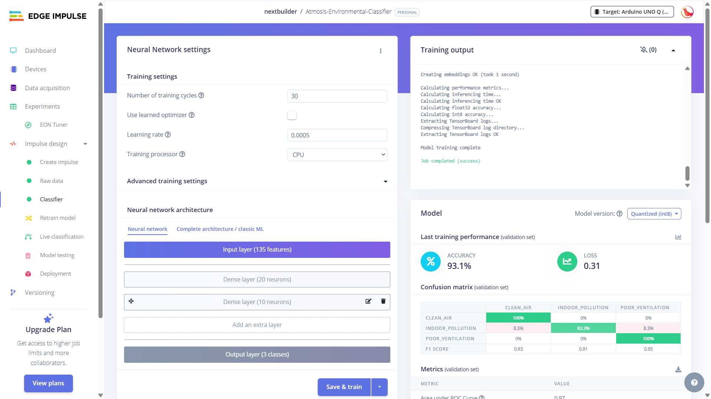</td>
</tr>
</table>
<sub>Edge Impulse Studio</sub>
</div>

<br/>

The classifier is what makes Atmosis more than a sensor readout. It was trained on real data recorded with this exact hardware, across seven patterns found indoors and outdoors. A dedicated data-collection sketch streamed all nine sensor channels as CSV at 5 Hz, and every class was captured under genuine, safe conditions.

| Class | Condition |
|---|---|
| `Clean_air` | Normal, relatively clean indoor air, recorded at different times and locations |
| `Traffic_pollution` | Short recordings near a busy road with passing traffic |
| `Construction_dust` | Genuine construction or dusty environments, when safely available |
| `Indoor_pollution` | Brief, controlled household sources such as cooking or incense |
| `Poor_ventilation` | Closed rooms where air quality degrades gradually |
| `Biomass_burning` | Naturally occurring smoke, captured only when safe |
| `Unusual_event` | Genuine anomalies that don't fit the other classes |

**Impulse:** nine time-series axes → Raw Data block → dense neural-network classifier → int8, EON Compiler.
On the UNO Q, the exported model runs directly in Python — no compile step. A new prediction must win three windows in a row and hold for 60 seconds before the dashboard or Telegram changes.

<br/>

---

<br/>

## Hardware

<div align="center">
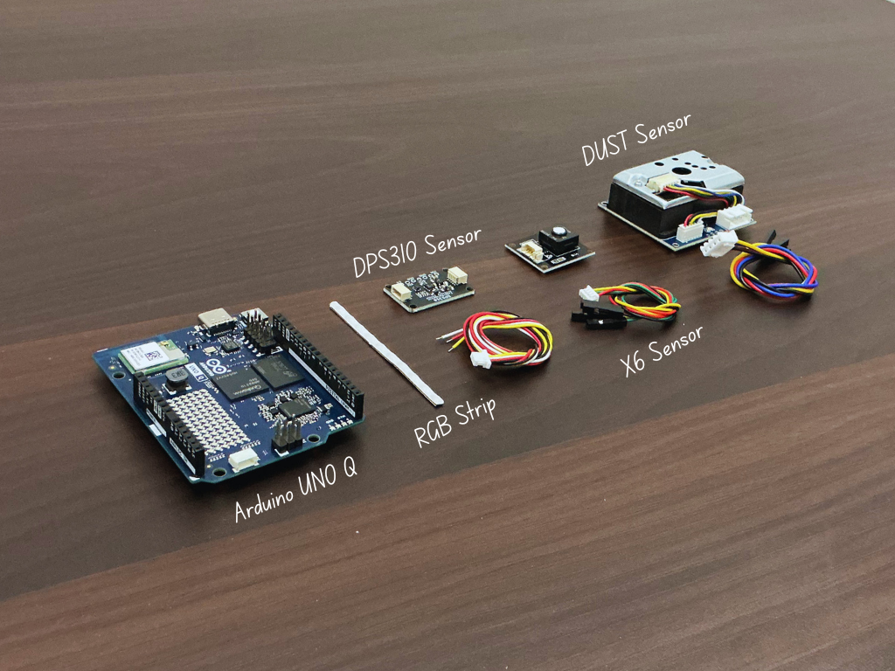
<br/>
<sub>All electronic components</sub>
</div>

<br/>

| Component | Role | Link |
|---|---|---|
| Arduino UNO Q | Dual-processor board — STM32U585 MCU + QRB2210 Linux | [Amazon](https://www.amazon.com/ABX00173-Dragonwing-microprocessor-STM32U585-Microcontroller/dp/B0GFN669S4/) |
| Waveshare Environment X6 | IAQ, VOCs, formaldehyde, CO, temperature, humidity | [Waveshare](https://www.waveshare.com/environment-x6-sensor.htm?&aff_id=135301) |
| Waveshare Dust Sensor | PM2.5 dust density | [Waveshare](https://www.waveshare.com/dust-sensor.htm?&aff_id=135301) |
| DPS310 pressure sensor | Barometric pressure and altitude | [Amazon](https://www.amazon.com/Industrial-Temperature-Supporting-Microcontrollers-Measurement/dp/B0H5NQJ7RR/) |
| Waveshare RGB COB strip (WS2812B) | Ambient air-quality light | [Waveshare](https://www.waveshare.com/rgb-27-5v-160d.htm?sku=34160?&aff_id=135301) |

<br/>

---

<br/>

## Wiring

<div align="center">

</div>

<br/>

| Waveshare X6 | UNO Q | | Dust sensor | UNO Q |
|---|---|---|---|---|
| VCC | 5V | | VCC | 5V |
| GND | GND | | GND | GND |
| TXD | D0 | | ILED | D4 |
| RXD | D1 | | AOUT | A0 |

| SmartElex DPS310 | UNO Q | | RGB strip | UNO Q |
|---|---|---|---|---|
| VIN | 3.3V | | DIN | D5 |
| GND | GND | | VCC | 5V |
| SDI | SDA | | GND | GND |
| SCK | SCL | | | |
| SDO, CS | — | | | |

> The SmartElex DPS310 labels its I²C pins `SCK` (clock) and `SDI` (data) — leave `SDO` and `CS` unconnected. Keep the light strip short, or power longer strips from a separate 5V supply with a shared ground.

<br/>

---

<br/>

## Enclosure Design

<div align="center">
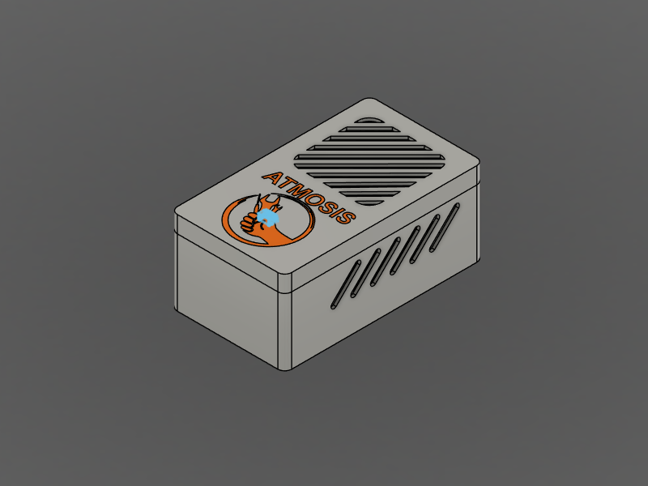
<br/><br/>
<table>
<tr>
<td align="center">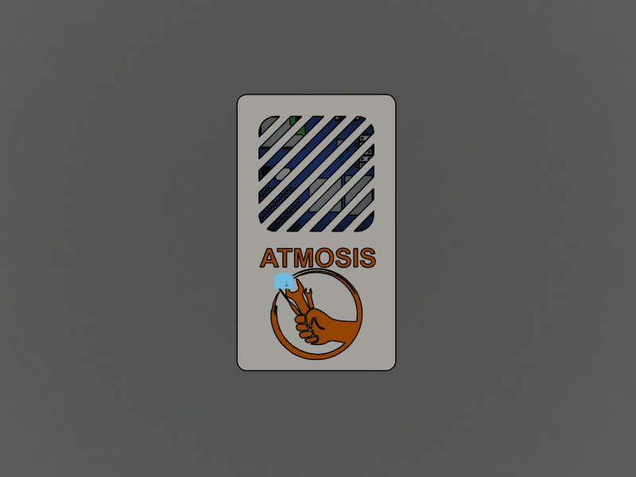</td>
<td align="center">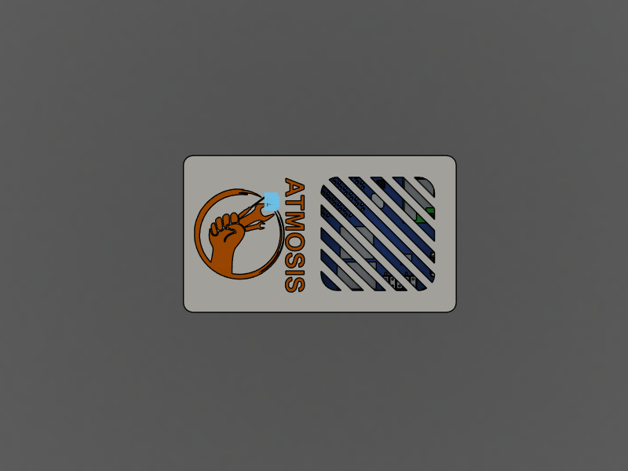</td>
<td align="center">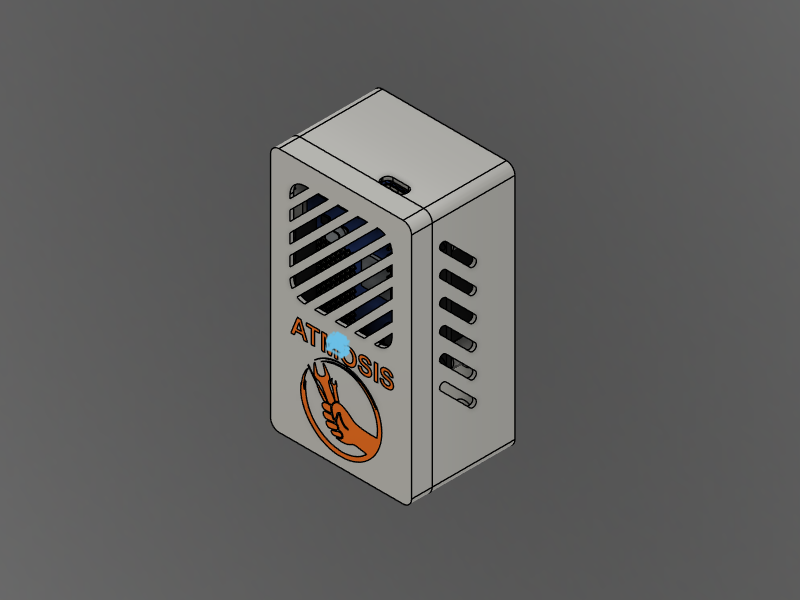</td>
</tr>
</table>
<sub>Custom 3D-printed enclosure — vented front grille for natural airflow across the sensors</sub>
</div>

<br/>

The two-part enclosure is designed around the UNO Q and all three sensors, with a ventilated grille so room air reaches the sensors freely. CAD files are in the [`CAD Design`](CAD%20Design) folder.

<br/>

---

<br/>

## Internal Assembly

<div align="center">
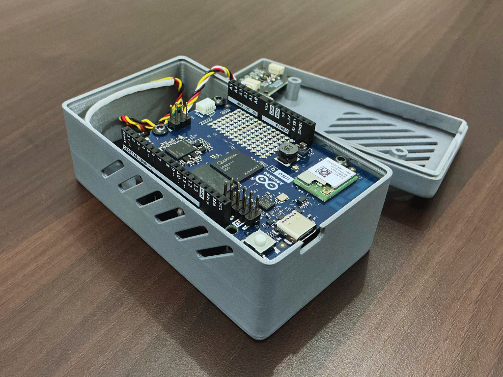
<br/><br/>
<sub>Inside view after complete wiring and assembly</sub>
</div>

<br/>

---

<br/>

## Getting Started

1. **Download** the latest release from [Releases](https://github.com/NextBuilder/Atmosis/releases/latest).
2. **Add your keys** — open `python/.env` and paste your Gemini API key, Telegram bot token and chat ID.
3. **Import** the folder into **Arduino App Lab** and press **Run**.
4. **Open** `http://<board-ip>:7000` on any device on the same Wi-Fi.

Full setup, configuration and troubleshooting are in the [App Lab README](Arduino%20App%20Lab).

<br/>

---

<br/>

## Repository Structure

```
Atmosis/
├── Arduino App Lab/         Firmware, Python app, dashboard and Edge Impulse model
├── Data Collection Code/    Sketch used to record the Edge Impulse training data
├── Circuit Diagram/         Wiring diagram
├── CAD Design/              3D-printable enclosure
└── Images/                  Photos and screenshots used in this README
```

<br/>

---

<br/>

## Atmosis in Action

<div align="center">
<table>
<tr>
<td align="center">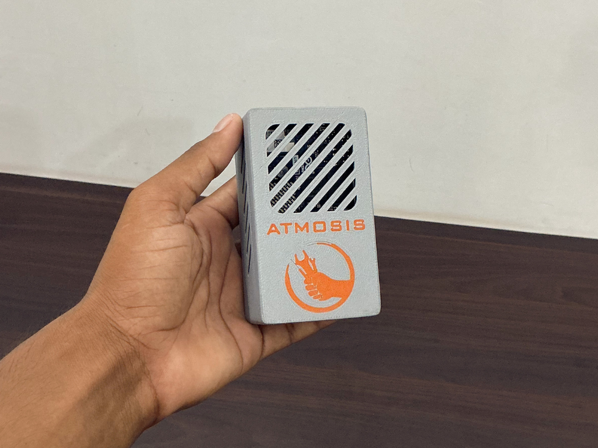</td>
<td align="center">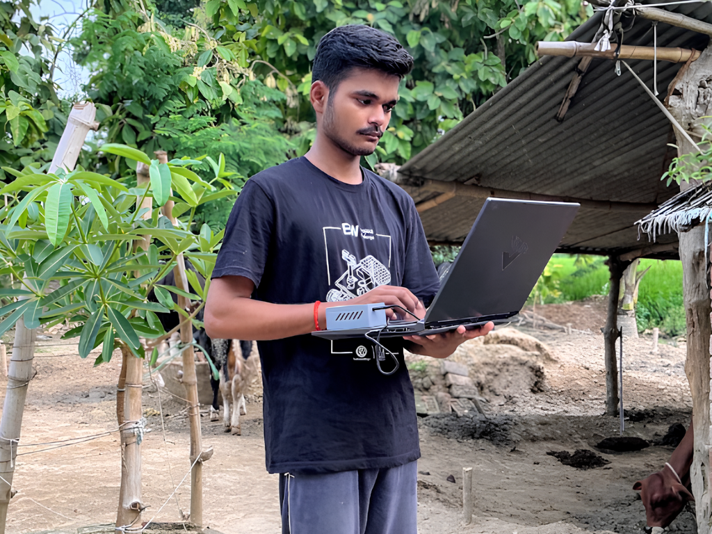</td>
</tr>
</table>
</div>

<br/>

---

<br/>

## Build Guide & Documentation

Step-by-step build instructions, assembly photos and testing are published on:

* **Instructables** — https://www.instructables.com/member/Next%20Builder%20DIY/
* **Hackster.io** — https://hackster.io/NEXTBUILDER
* **Hackaday.io** — https://hackaday.io/NextBuilder

All firmware, the Python app, the Edge Impulse model, CAD files and the circuit diagram are available in this repository.

<br/>

---

<br/>

## License

Released under the **MIT License** — see [LICENSE](LICENSE).

<br/>

---

<br/>

<div align="center">

Built with ❤️ by **[Next Builder](https://youtube.com/@nextbuilderio)**

*Built one? Share it. Open an issue, tag us, drop a photo — the community makes this worth building.*

*⭐ Star this repo if it helped you build something awesome ⭐*

</div>
