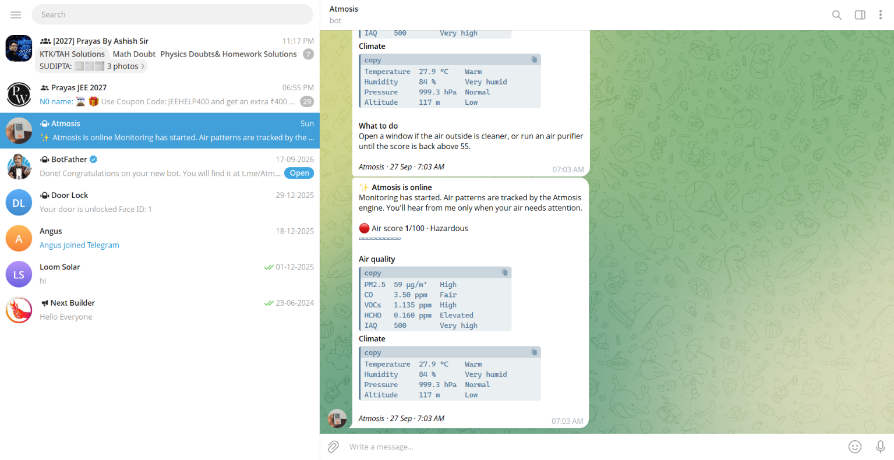
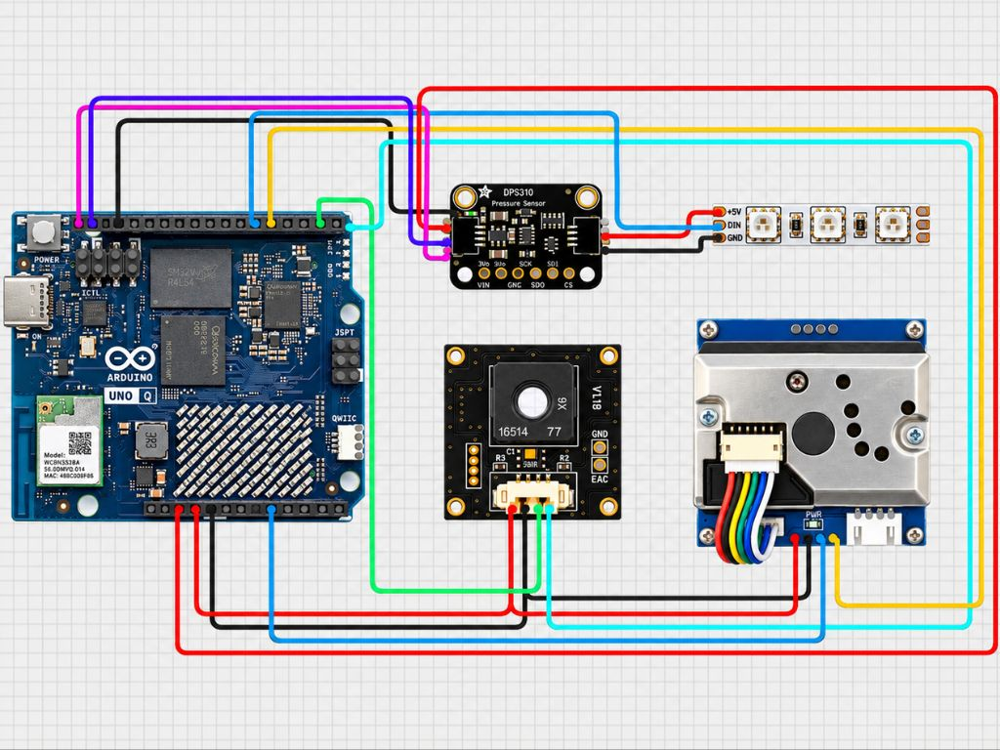

# Atmosis

**Real-world air intelligence, built on the Arduino UNO Q**

## Overview

The air around us rarely announces itself. Exhaust from a busy road, dust from a building site, smoke from burning leaves, fumes from a kitchen, or a closed room slowly running out of fresh air — most of it is invisible, and almost none of it is measured.

**Atmosis** is a small device that watches the air every second and tells you what's going on. It turns nine sensor readings into one simple **air score from 1 to 100**, recognises the situation behind the numbers with an **Edge Impulse** model, and uses **Gemini 3.5 Flash** to suggest exactly what to do — on a live dashboard and on your phone through **Telegram**.

The safety features run on the board itself, so the light strip and the dust and carbon-monoxide alarms keep working even without the app or the internet.

## Highlights

- **Nine live readings** — IAQ, VOCs, formaldehyde, CO, PM2.5, temperature, humidity, pressure and altitude
- **Seven air patterns** — an Edge Impulse model trained on real data, from clean air to traffic, dust and smoke
- **Smart advice** — Gemini 3.5 Flash speaks up only when the air needs attention
- **Instant alerts** — clean Telegram cards and a daily air report
- **Live dashboard** — glass-style web app in light and dark themes
- **Works offline** — air score, light and alarms run on the microcontroller

## Dashboard

 
Air score, live sensor tiles, Gemini health advisor and trends — in light and dark themes

## Telegram Alerts

Every alert is a short card with the air score, all readings, one clear action and a tip from Gemini.

| When | Alert |
|---|---|
| Air score drops to 35 | Air quality needs attention |
| PM2.5 goes above 150 µg/m³ | Very high dust level |
| CO goes above 9 ppm | Carbon monoxide alert, sent instantly |
| Indoor pollution or poor ventilation detected | Air pattern alert |
| Board silent for 2 minutes | Sensors offline |
| Every evening at 9 PM | Daily report with averages and peaks |

## How It Works

The **Arduino UNO Q** has two processors on one board, and Atmosis uses both:

- **STM32U585 microcontroller** — reads the sensors, calculates the air score, drives the light strip and handles the safety alarms.
- **Qualcomm QRB2210 running Linux** — runs Edge Impulse, the Gemini advisor, Telegram and the dashboard.

Once a second, the microcontroller sends a fresh set of readings to Linux. Nothing is ever sent back, so the board stays safe on its own.

## Edge Impulse

 

The model was trained on real data recorded with this exact hardware. A data-collection sketch logged all nine readings at 5 Hz, and each pattern was captured in genuine, safe conditions.

| Pattern | Recorded in |
|---|---|
| Clean air | Normal indoor air at different times and places |
| Traffic pollution | Short sessions near a busy road |
| Construction dust | Real construction or dusty sites |
| Indoor pollution | Cooking, incense and similar household sources |
| Poor ventilation | Closed rooms where the air slowly goes stale |
| Biomass burning | Naturally occurring smoke |
| Unusual event | Real anomalies that don't fit the other patterns |

The model runs directly on the UNO Q. To avoid false alarms, a new pattern has to show up three times in a row and hold for a minute before Atmosis reports it.

## Hardware

| Component | Purpose | Link |
|---|---|---|
| Arduino UNO Q | Main board | [Amazon](https://www.amazon.com/ABX00173-Dragonwing-microprocessor-STM32U585-Microcontroller/dp/B0GFN669S4/) |
| Waveshare Environment X6 | Gases, temperature, humidity | [Waveshare](https://www.waveshare.com/environment-x6-sensor.htm?&aff_id=135301) |
| Waveshare Dust Sensor | PM2.5 dust | [Waveshare](https://www.waveshare.com/dust-sensor.htm?&aff_id=135301) |
| DPS310 Pressure Sensor | Pressure and altitude | [Amazon](https://www.amazon.com/Industrial-Temperature-Supporting-Microcontrollers-Measurement/dp/B0H5NQJ7RR/) |
| Waveshare RGB COB Strip | Air-quality light | [Waveshare](https://www.waveshare.com/rgb-27-5v-160d.htm?sku=34160?&aff_id=135301) |

## Wiring

| Module | Power | Signal |
|---|---|---|
| **Environment X6** | 5V · GND | TXD → D0 · RXD → D1 |
| **Dust Sensor** | 5V · GND | ILED → D4 · AOUT → A0 |
| **DPS310** | 3.3V · GND | SDI → SDA · SCK → SCL |
| **RGB Strip** | 5V · GND | DIN → D5 |

> **Tip:** On the SmartElex DPS310, `SCK` is the clock pin and `SDI` is the data pin. Leave `SDO` and `CS` unconnected.

## Enclosure

 

A compact two-part 3D-printed case, designed around the UNO Q and all three sensors. Angled slots on the front and sides let room air flow across the sensors, and the lid comes off easily for wiring. The CAD files are in the [`CAD Design`](CAD%20Design) folder.

 
Inside, after wiring and assembly

## Getting Started

1. Download the latest version from [Releases](https://github.com/NextBuilder/Atmosis/releases/latest).
2. Open `python/.env` and paste your Gemini API key, Telegram bot token and chat ID.
3. Import the folder into **Arduino App Lab** and press **Run**.
4. Open `http://<board-ip>:7000` on any device on the same Wi-Fi.

Full setup and troubleshooting are in the [App Lab guide](Arduino%20App%20Lab).

## Repository

| Folder | Contents |
|---|---|
| [`Arduino App Lab`](Arduino%20App%20Lab) | Firmware, Python app, dashboard and Edge Impulse model |
| [`Data Collection Code`](Data%20Collection%20Code) | Sketch used to record the training data |
| [`Circuit Diagram`](Circuit%20Diagram) | Wiring diagram |
| [`CAD Design`](CAD%20Design) | 3D-printable enclosure |
| [`Images`](Images) | Photos and screenshots |

## In Action

## Build Guide

Step-by-step instructions, assembly photos and testing are available on:

- **Instructables** — https://www.instructables.com/member/Next%20Builder%20DIY/
- **Hackster.io** — https://hackster.io/NEXTBUILDER
- **Hackaday.io** — https://hackaday.io/NextBuilder

## License

Released under the [MIT License](LICENSE).

 

Built with ❤️ by **[Next Builder](https://youtube.com/@nextbuilderio)**

*Built one? Share it — open an issue, tag us, or drop a photo.*

*⭐ Star this repo if it helped you build something awesome ⭐*

